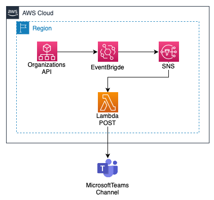

# Terraform AWS How to Monitor important changes in Organization

AWS Organizations is an account management service that enables you to consolidate multiple AWS accounts into an organization that you create and centrally manage. As an administrator of an organization, you can create accounts in your organization and invite existing accounts to join the organization. Organize into organizational units, attach compliance policy as an SCP and Tag Policy and consolidated billing capabilities that enable you to better meet the budgetary, security, and compliance needs of your business.

This template shows how to monitor important changes in your organization. 



This template has a terraform modules that provides the following resources:

- [IAM Roles](https://github.com/jslopes8/terraform-aws-iam-roles)
- [EventBrigde Rule](https://github.com/jslopes8/terraform-aws-cw-event-rules)
- [SNS Topic](https://github.com/jslopes8/terraform-aws-sns)
- [Lambda Function](https://github.com/jslopes8/terraform-aws-lamda.git)

## Directory tree structure
```bash
terraform-aws-guardrail-violation$ tree
.
├── lambda-code
│   └── lambda_function.py
├── img
│   └── MonitorImportChange.png
├── cloud-config.tf
├── main.tf
└── README.md

2 directories, 5 files
```

### Understanding the structure of the template
- `cloud-config.tf` - AWS credentials as well as setting the Terraform Backend S3.
- `main.tf` - file with the main settings for the stack set, detail below.

#### The contents of the main file:
- `data-sources` - At runtime, get the current account id and region.
- `eventbridge_rule` - Creation of Rules, the event pattern that EventBrigde will receive, with the names of the configRules that will be monitored with the compliance policy.
- `sns_topic` - Create an SNS Topic Endpoint for Lambda
- `lambda_func` - Create a Lambda Function, with an environment variable for Teams Webhook to POST to a channel of your choice.

## Important
>A best-practice of using Terraform is not to put your access keys and secret in the configuration file. My recommendation is to use the configuration file to specify your credentials. The default location is "$HOME/.aws/credentials" on Linux and macOS or "%USERPROFILE%\.aws\credentials" on Windows. By setting the profile argument in the provider block, by default terraform will fetch this information from this configuration file with your credentials.

## Usage
Terraform Module EventBridge Rule: List with the names of APIs that you want monitored.
```bash
module "eventbridge_rule" {
  source  = "git::https://github.com/jslopes8/terraform-aws-cw-event-rules.git?ref=v1.1"

  name        = local.stack_name
  description = "${local.stack_name} Notification"

  event_pattern = jsonencode({
    "source": ["aws.organizations"],
    "detail-type": ["AWS API Call via CloudTrail"],
    "detail": {
      "eventSource": ["organizations.amazonaws.com"],
      "eventName": [
        "DetachPolicy", 
        "UpdatePolicy", 
        "DeleteOrganizationalUnit",
        "UpdateOrganizationalUnit",
        "MoveAccount"
      ]
    }
  })

  targets = [
    {
      target_id  = "SendToSNS"
      arn = module.sns_topic.arn["ARN"]
    
      input_transformer = [{
        input_paths = {
          "account":"$.account",
          "actions":"$.detail.eventName",
          "policyId":"$.detail.requestParameters.policyId",
          "sourceIPAddress":"$.detail.sourceIPAddress",
          "target_id":"$.detail.requestParameters.targetId",
          "time":"$.detail.eventTime",
          "user":"$.detail.userIdentity.principalId"
        }
        input_template = "\"Notificação de Mudança em AWS Organizations Account Id <account> em <time> pelo usuario <user> com IP de origem <sourceIPAddress>. Realizou uma ação de <actions> para o policy id <policyId> em <target_id>.\""
      }]
    }
  ]

  default_tags = local.default_tags
}
```
Terraform Module Lambda Function: WebHook POST to Teams Channel 
```bash
module "lambda_func" {
  source = "git::https://github.com/jslopes8/terraform-aws-lamda.git?ref=v0.1.0"

  function_name = local.stack_name
  description   = "${local.stack_name} Notification Microsoft Teams Channel"

  handler = "lambda_function.lambda_handler"
  runtime = "python3.6"
  timeout = "3"
  role    = module.iam_role_lambda.role_arn

  environment = {
    WebHookTeams = "https://exemple.webhook.office.com/webhookb2/92a06e6e-634a"
  }

  archive_file = [{
    type        = "zip"
    source_dir  = "lambda-code"
    output_path = "lambda-code/lambda_function.zip"
  }]

  lambda_permission   = [
    {
      statement_id  = "AllowExecutionFromCloudWatch"
      action        = "lambda:InvokeFunction"
      principal     = "events.amazonaws.com"
      source_arn    = module.eventbridge.cw_arn
    },
    {
      statement_id  = "AllowExecutionFromSNS"
      action        = "lambda:InvokeFunction"
      principal     = "sns.amazonaws.com"
      source_arn    = module.sns_topic.arn["ARN"]
    }
  ]

  default_tags = local.default_tags
}
```


## Result
For this example, I detach a SCP Policy from one OU.

### View the log.
You should see a message similar to the following:

>Notificação de Mudança em AWS Organizations Account Id 1234123445 em 2021-07-16T19:20:29Z pelo usuario ARXTERTBGBERTYTEDFGSDF:jlopsti@test.com com IP de origem 100.107.100.121. Realizou uma ação de DetachPolicy para o policy id p-wyfxxnov em ou-xu7c-0uv7ba3r.

## Requirements
| Name | Version |
| ---- | ------- |
| aws | ~> 3.1 |
| terraform | ~> 0.14 |